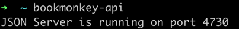
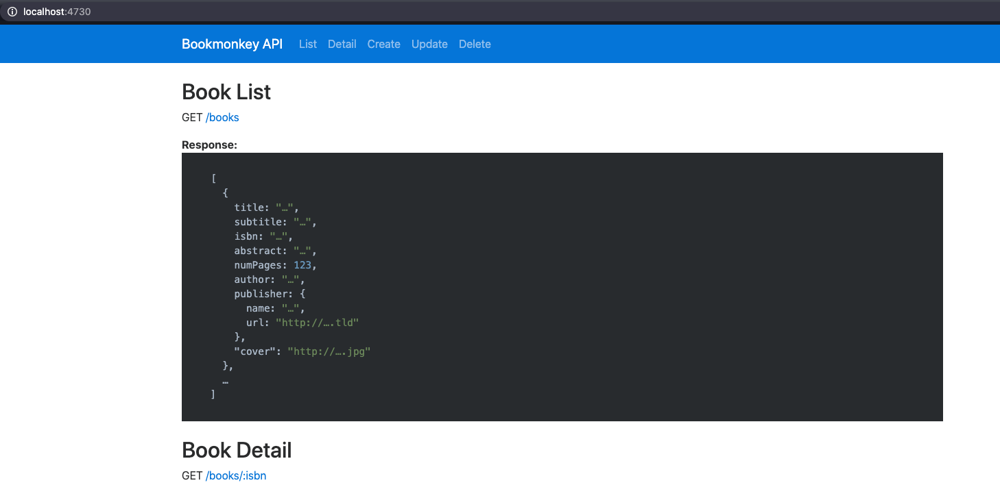

# Prerequisites and project setup

- Nodejs >= 12.x
- AngularCLI >= 9.x

## Install dummy Backend:

`npm i -g bookmonkey-api`

Starting the Backend

:

Swagger-Documentation:

`http://localhost:4730/`

## Install dependencies inside book-app-ngrx root directory

`npm install`
