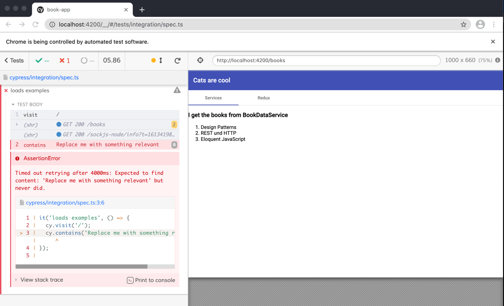

# Setup and Run Cypress

1. Install Dependencies 
   1. `npm install cypress --save-dev`
   2. `ng add @briebug/cypress-schematic`

(It might be already installed and added so just run npm i instead)


2. Run e2e Tests:

```ecmascript 6
npm run e2e
```
The Output (could take a while ;-) ) should look something like this:


